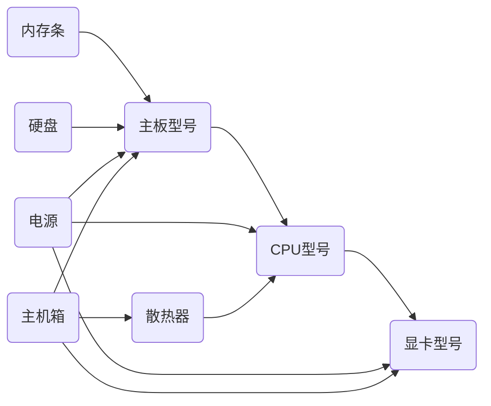

# 个人大件DIY

这周做了一件前进一小步的事情, 那就是组装一台自己的台式机，可能在很多人看来这并不算啥。但是习惯精打细算的我，觉得还是有必要记录下。因为这是自己准备实践机器学习和个人被动收入提升计划的一个开端。有时觉得这开端进度有点慢，让我想起，纠结小事的人干不了大事。但是这种想法还是被我忽略了，其实我是不纠结小事的。我是非常享受组装一台自己台式机整个过程的。首先我非常明确自己的目标是自己且可以跑机器学习的机器。以下是自己的一个硬件选配的决策流程：
首先一台台式机由：**显卡、CPU、主板、内存条、硬盘、电源、散热器、主机箱、风扇**组成。其中显卡的选择不依赖其它硬件, CPU对GPU有一定依赖，而主板的则非常依赖CPU的型号，而内存条和硬盘的选择则依赖主板，PCIe总线的频率,而电源的选择则需要综合GPU和CPU加上主板的整体功率来决定的，散热器的选择则直接依赖CPU型号，而散热器类型，电源尺寸，显卡尺寸决定了机箱的选择。所以整体下来是这样的一个依赖关系

从上面的依赖图可以看出显卡对其它硬件依赖程度最低，所以硬件的选择顺序也就从上述节点的依赖程度，以依赖度作为排序度量，其中我选择的一个优先级是**1：显卡； 2：CPU；3：主板；4：散热器；5：内存；6：硬盘；7：电源；8：散热器；9：主机箱**
### 显卡
它只依赖于个人的最低要求，比如打个英雄联盟，那么一千块的RTX20系列显卡就戳戳有余了，如果想玩个大表哥，赛博朋克，那么RTX30系列也够用。对于最近出的RTX40系列，除了4090外，其它40系列性价比都比较低。
可以跑机器学习的那么对显卡的要求就是显存大于等于12G可以跑60-70%的模型。对于在机器学习领域还是初学者的我来说，这足够我目前使用了，等后面有可能深入的时候，其实就算我买了台RTX4090,显然也是大概率不满足硬件需求的，工业界现在都是堆显卡来满足LLM训练需求的。对于这种硬件产品没有最贵的，只有更贵的，反正价格越高性能相对就会好一些，但是多付出的价格带来多少的提升就是一门学问。​https://timdettmers.com/2023/01/30/which-gpu-for-deep-learning/ 那么怎么选择合适的显卡呢，上面博客的大佬说了，3080和4070Ti性价比高。但是4070相对3080价格贵了几千块，对于现在的我，果断选择3080，我觉得它完全够我的需求，唯一的风险就是可能买到**矿卡**。所以型号基本就这样确定了，但是目前仍然没有下单....
## CPU和主板
为什么要把CPU和主板一起说呢，因为它俩**一起购买会有优惠**仅此而已，在CPU选择这块，开始我也是一脸懵圈，什么i5 12600k 12600f 12600kf 12600等，i5和i7有什么区别字母f表示不带集成显卡，K表示可超频,i5 和i7表现在核心内存共享模式上，i7核心有自己独立的cache,i5则是共享cache，睿频，超频等各种新的概念用上来，所以必须弄清楚这些是什么东西并根据自己的需求决定选择哪款型号，因为自己都选择的3080显卡的，CPU肯定不能太低，CPU处理速度太慢会严重拖累显卡的性能表现，通过网上各种查，CPU的性能表现对比,最终选定i7 13700k, 这种CPU功耗一般在230w, 超频会更高些，带动这种CPU的主板BM760基本够用，但是为未来留点升级空间，所以我选择的Z790 主板,这个主板支持DDR5
## 内存
因为主板支持DDR5，所以内存选择的D5类型的，16x2的内存,这个决策起来还是比较快的
## 硬盘
选择了1T的固态，6000M的，这个在主板选择完成后，决策起来也非常快
## CPU散热器
因为是13700K 虽然功率较大的风冷满足需求，但是比较容易受限，240的水冷满足不了需求，所以只能选择360的水冷，风险点在于存在漏液的风险，所以购买就在某东上购买，保3年漏液赔付。
## 电源
（CPU功率 + GPU功率）* 4/3 就是电源的最低要求，但是电源功率每提升几十瓦，价格就贵不少，综合可扩展性+品牌这2个因素，我最终选择了850w的长城电源.
## 机箱
目前还没选定，这块价格差异也特别大, 需要自己快速选择下，在这个花太多时间不值得。
以上就是本周组装电脑整体决策流程。其中一个点，感觉还是非常难量化的，就是性价比，很多硬件的影响价格因素较多，有些因素没法直接量化，比如好看与否，什么品牌，不同品牌同一型号，价格都不一样。是个值得思考的问题。
## 电脑组装

GPU 3080 12g 功耗350w / 4090 24g 
    30系列容易是矿卡，具有一定风险 40系列基本1w+
CPU 13700K 功耗250w-270W 2585￥ --4359￥
    不容易坏，淘宝买即可, 它决定了主板的选择
主板
    TB 1999￥
    和CPU 一起更优惠
电源
    >=850w --604￥
    JD https://item.jd.com/100033056611.html?bbtf=1#crumb-wrap
内存
    JD DDR5 6000MHZ --799￥
    频率选择
硬盘
    JD 1T --369￥
CPU散热器
    水冷 JD --529￥
    风冷 都可以
    最好弄个导热性好的硅脂胶
机箱
    JD
    长度大于351mm
    机箱前部有进风口
    https://detail.tmall.com/item.htm?abbucket=11&id=590680209098&ns=1&skuId=5175518039666&spm=a230r.1.14.66.40a938aacvSums

显示器

这周工作上，依旧是按部就班的完成自己分内分外的事情。倒没有多大的提升，不幸的是这周二阳了，周末2天在发烧中度过了。这周没看书，似乎都在忙着PC 配件选择上了。尴尬. 投机上，这周卖了3姐套了很久的天创转债，101.5卖的，赚了25块吧，差不多这么时间的利息了T.T。然后在自己账户投机一把98块，买了一手回来，准备100块就卖了。只是纯投机操作。

## 引用
1. https://zhuanlan.zhihu.com/p/618026401
2. https://www.zhihu.com/answer/544681382
3. https://www.zhihu.com/answer/2651115883
4. https://www.zhihu.com/answer/1697200361
5. https://www.zhihu.com/tardis/zm/art/571526782?source_id=1003