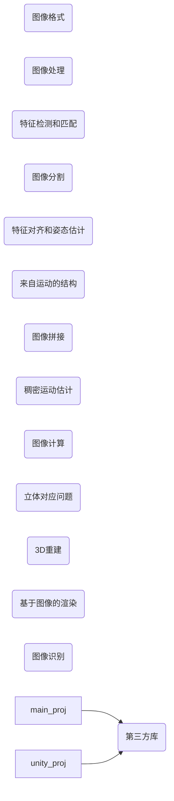

# Computer Vision
Author: Richard Szeliski

## mind map

```mermaid
graph LR;
    ImageFormation(图像格式)
    ImageProcess(图像处理)
    FeatureDetectionAndMatching(特征检测和匹配)
    Segmentation(图像分割)
    Feature-basedAlignment(特征对齐和姿态估计)
    StructureFromMotion(来自运动的结构)
    ImageStitching(图像拼接)
    DenseMotionEstimation(稠密运动估计)
    ComputationalPhotography(图像计算)
    StereoCorrespnedence(立体对应问题)
    3DReconstruction(3D重建)
    Image-basedRendering(基于图像的渲染)
    Recognition(图像识别)

    main_proj-->libX(第三方库)
    unity_proj-->libX
```
